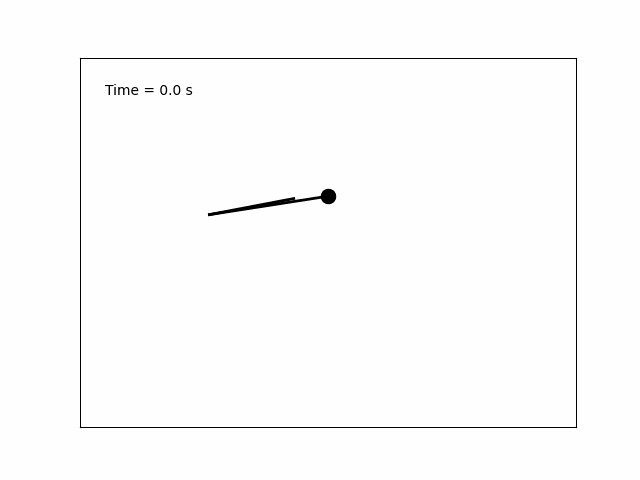

# Double Pendulum Simulation



The Double Pendulum is a classic example in physics that exhibits complex and chaotic behavior. This repository provides a Python implementation of a double pendulum simulation using numerical methods. It uses the SciPy library for solving the differential equations and Matplotlib for visualizing the motion.

## Table of Contents

- [Introduction](#introduction)
- [Prerequisites](#prerequisites)
- [Installation](#installation)
- [Usage](#usage)
- [Algorithm](#algorithm)
- [Simulation Parameters](#simulation-parameters)
- [License](#license)

## Introduction

A double pendulum consists of two pendulums attached end to end, where the motion of the second pendulum depends on the position and velocity of the first pendulum. Due to its sensitivity to initial conditions, a double pendulum's motion can become highly unpredictable and chaotic, making it a fascinating subject for study.

This simulation provides a visual representation of the motion of a double pendulum. Users can explore how changes in initial conditions affect the pendulum's behavior.

## Prerequisites

To run this simulation, you'll need:

- Python 3.x
- NumPy
- SciPy
- Matplotlib

You can install the required packages using pip:

```bash
pip install numpy scipy matplotlib
```

## Installation

1. Clone this repository to your local machine:

```bash
git clone https://github.com/your-username/double-pendulum-simulation.git
```

2. Navigate to the project directory:

```bash
cd double-pendulum-simulation
```

## Usage

To run the double pendulum simulation, execute the following command:

```bash
python double_pendulum_simulation.py
```

This will display a window with the double pendulum animation. You can close the window to stop the simulation.

## Algorithm

The simulation uses the `odeint` function from the SciPy library to solve the system of ordinary differential equations (ODEs) that describe the double pendulum's motion. The ODEs are derived from the Lagrangian mechanics principles.

The key equations used in the simulation are:

- Equations of motion for the first pendulum:
  - Angular acceleration (`theta1_dot_dot`)
  - Angular velocity (`theta1_dot`)
  - Angle (`theta1`)

- Equations of motion for the second pendulum:
  - Angular acceleration (`theta2_dot_dot`)
  - Angular velocity (`theta2_dot`)
  - Angle (`theta2`)

The motion is computed over a specified time period, and the positions of the pendulum masses are calculated at each time step. Matplotlib is used to visualize the motion by drawing the pendulum rods and bobs at each time step.

## Simulation Parameters

You can customize the simulation by adjusting various parameters in the code:

- Masses of the pendulum bobs (`m1` and `m2`)
- Lengths of the pendulum rods (`L1` and `L2`)
- Gravitational acceleration (`g`)
- Initial conditions (angles and angular velocities)

The code also includes mechanisms to prevent the simulation from getting stuck in a stable configuration by reinitializing the pendulum with random initial conditions if needed.

## License

This project is licensed under the MIT License. See the [LICENSE](LICENSE) file for details.
